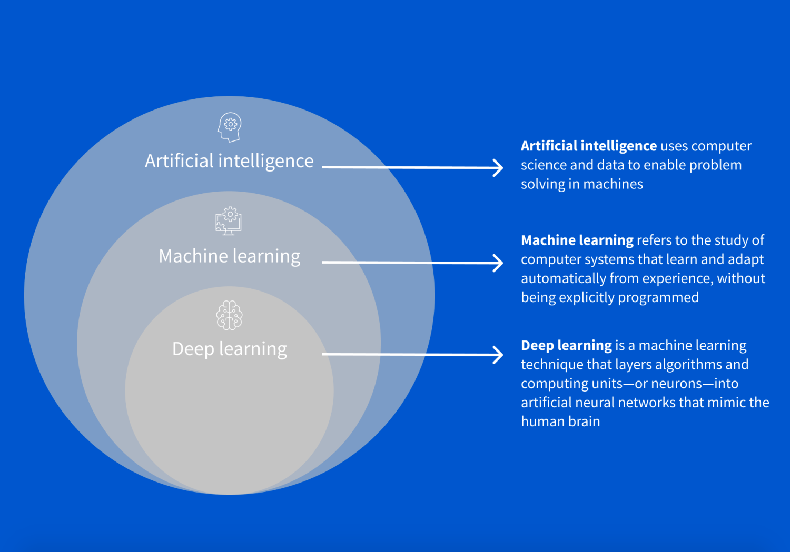

## Basics

**Artificial Intelligence** -
At its most basic level, the field of artificial intelligence uses computer science and data to enable problem solving in machines. 

- simulates human intelligence to perform tasks and make decisions.
- can handle various tasks, from simple to complex, across domains.
- algorithms can be simple or complex, depending on the application.

**Machine Learning** -
Machine learning refers to the study of computer systems that learn and adapt automatically from experience without being explicitly programmed.
A machine learning algorithm can learn from relatively small sets of data, but a deep learning algorithm requires big data sets that might include diverse and unstructured data.

- it is a subset of AI that uses algorithms to learn patterns from data.
- heavily relies on labeled data for training and making predictions.	
- automates learning from data and requires less manual intervention.
- specializes in data-driven tasks like classification, regression, etc.
- employs various algorithms like decision trees, SVM, and random forests.

**Deep Learning** - 
Deep learning is a machine learning technique that layers algorithms and computing units—or neurons—into what is called an artificial neural network. These deep neural networks take inspiration from the structure of the human brain. Data passes through this web of interconnected algorithms in a non-linear fashion, much like how our brains process information. 

- it is a subset of ML that employs artificial neural networks for complex tasks.
- requires extensive labeled data and performs exceptionally with big datasets.
- DL automates feature extraction, reducing the need for manual engineering.
- excels at complex tasks like image recognition, natural language processing, and more.

Machine learning and deep learning are both types of AI. In short, **machine learning** is AI that can automatically adapt with minimal human interference. **Deep learning** is a subset of machine learning that uses artificial neural networks to mimic the learning process of the human brain.