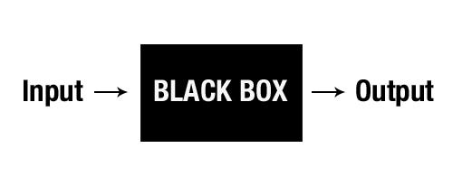
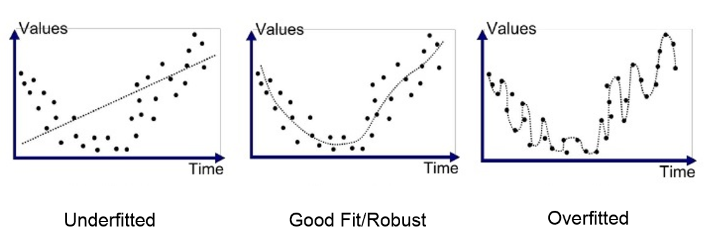

## "Black Box" Metaphore 

* Typically the brain behind ML module is encapsulated inside a black box which take an input and output.
* Its a black box since the details behind the implementation is generally not known, not  only that the training mechanism and the accuracy of the trained model is also not known

## Feature and Labels

**Feature** -
* Features are the input data. There should be multiple feature included to generate a effective model
* example - in a intelligence for spam detection, feature can be 
    - sender address
    - time or hour of the day email was sent
    - list of spam words found in the email

Mathematically it is represeted as vector of size on N

$X = (x_{1},x_{2},x_{3},...x_{n})$

**Label** -
* It is the output of the system. It is the thing which it needed to predect
* example - if a email was marked as spam or not spam

Mathematically it is represeted as function x

$Y=f(x)$

**Examples** -
Example is the single instance of data.
There are 2 types -
* Labeled example - includes the features(x) and labled for the features(y)

$(x,y)$

* Unlabled example - includes only features(x).

$(x,?)$

## Model
**Training DataSet** -
* It is a large group of labeled examples.
* ML system is going to learn the pattern in the dataset and store them in **model**
* this **model** is supposed to define the relation between the feature and label as close as possible

There are two steps in creating a model
* **Training** - it is the step where a ML system is provided huge amount of labled examples(typically in supervise learning) to generate the model
* **Infrence** - in this step the generated ML model is fed another set of example to predict the expected output

## Underfitting 
Refers to situation where the trained model is not working well in the training data and cannot generalize to new dataset.

It failed to caputure the underlying relation in data

**Reason for underfitting** - 
* Model is too simple and a more complex model is required using a different algorithm.
* Training data set is not good enough, i.e it might not contain good varied example to cover different outcomes.

## Overfitting
After reaching a optimum point, the model testing performance starts to degrade because of learning patterns specific to the training data, making it irrelevent to new data.

Here the trained model works well on training data only.

**Reason for overfitting** - 
* Training data is a small sample of a much larger dataset, to solve this use larger sample size.
* Model is too complex and tries to fit perfectly to the dataset.

