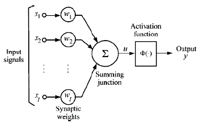

# Neural Networks

### Artificial Neural 



**Sum function** - 
---
$sum = \sum_{i=1}^n xi * wi  $

**Activation function** - 
---
* It’s a function that is used to get the output of node.
* used to determine the output of neural network like yes or no. It maps the resulting values in between 0 to 1 or -1 to 1 etc. (depending upon the function).

Several different types of activation functions are used in Deep Learning. Some of them are explained below:
* **Step function** - 

    $ f(x) = 1,\ \ \ if x > 1 $ <br>
    $ f(x) = 0,\ \ \ if x <=0 $


* **Sigmoid Function** -
Sigmoid function is a widely used activation function.
    
    $\cfrac{1} { (1+e^{-x}) }$

* **ReLU** -
The ReLU function is the Rectified linear unit. It is the most widely used activation function. It is defined as

    $ f(x) = \max(0, x) $

</br>

**error calculation**
---
$ error = expected \ \ output - predection $


---

example 

step function  -
```
Greater or equal 1 = 1
otherwise 0
```
calculation - 
```
x = 1,7,5
w = 0.8, 0.1, 0 

sum = (1 * 0.8) + (7 * 0.1) + (5 * 0) 
sum = 1.5

output = 1
```

**Update Next Epoch Weight**
---

$ weight(n+1) = weight(n) + (learningRate * input * error) \\ where , \\
    n = current ephoc \\
    n+1 = next ephoc
$

example -

w(n+1) = 0 + (0.1 * 1 * 1) = 0.1

here,
* learnigRate is defined by developer as 0.1
* error is the error in the ephoc

